## iPhone|Lovers 


**iPhone|Lovers** blog website is developed using Django Framework as part of Portfolio Project 4 for my Diploma in Full Stack Software Development at Code Institute.

It targets the most loving series of the iPhones as worldwide people like iphones a lot, where user can view the blog post of their favourite iPhone model, they can comment about a particular iPhone model even if they are not iPhone lovers but they want to give some sort of feedback about a smartphone what they like, they can do a blog post and comments. When the user is logged in, user can like/unlike a post, comment on a post and add a post from the user page.

You can view the live site here:-  https://iphonelovers-1bcbfe91e39d.herokuapp.com

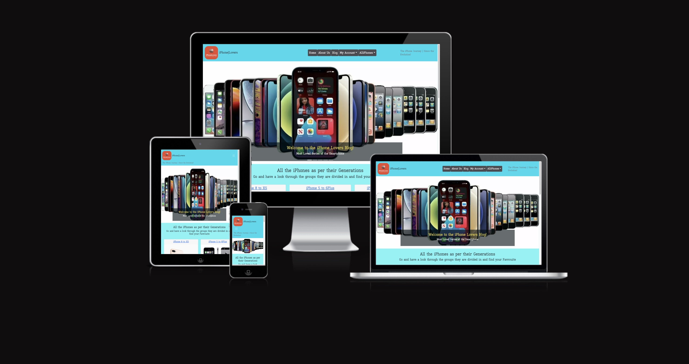


## [Content](#content)
- [iPhoneLovers- Introduction](#iphonelovers---introduction)
  - [User Experience - UX](#user-experience---ux)
    - [User & Blog Goals](#User-&-Blog-Goals)
    - [Agile Methodology](#agile-methodology)
      - [Epics and User Stories](#epics-and-user-stories)
      - [Tasks](#tasks)


  - [Design](#design)
    - [Colours](#colours)
    - [Typography](#typography)
    - [Imagery](#imagery)

  - [Database Diagram](#database-diagram)

    - [Features](#features)
    - [Home Page](#home-page)
      - [Navbar](#navbar)
      - [Hero Image](#hero-image)
      - [AlliPhone Section](#iPhone-section)
      - [Footer](#footer)
    - [User Page](#user-page)
    - [About Page](#about-page)
    - [Blog Page](#blog-page)
      - [Blog Details](#blog-details)
      - [Blog Comments](#blog-comments)
    - [Register](#register)
    - [Login](#login)
    - [Logout](#logout)
    - [AlliPhones](#AlliPhones)
    - [Alert Messages](#alert-messages)
    - [Admin Panel/Superuser](#admin-panelsuperuser)
  - [Technologies Used](#technologies-used)
    - [Languages Used](#languages-used)
    - [Django Packages](#django-packages)
    - [Frameworks - Libraries - Programs Used](#frameworks---libraries---programs-used)
  - [Testing](#testing)
      - [Validation](#validation)
      - [Manual Testing](#manual-testing)
  - [Bugs](#bugs)
      - [Fixed Bugs](#fixed-bugs)
      - [Unfix Bugs](#unfix-bugs)
  - [Deployment](#deployment)
      - [Creating the Django project](#creating-the-django-project)
      - [Creating Heroku app](#creating-heroku-app)
      - [Set up Environment Variables](#set-up-environment-variables)
      - [Heroku deployment](#heroku-deployment)
      - [Final Deployment](#final-deployment)
  - [Credits](#credits)
    - [Content](#content)
    - [Information Sources / Resources](#information-sources--resources)
  - [Acknowledgement](#acknowledgement)

-----   


# User Experience - UX

## User & Blog Goals

### Targeted User Goals:
A user interested in visiting iPhones/smartphones.
A user who likes/loves iPhone or similarly interested in a smartphone.
A user that wants a platform to share their own feedback.

### Site User Goals:
For users to be able to interact with the site intuitively.
For users to be able to access and view all posts.
For users to be able to read information oabout iPhones and related posts.
For users to be able to create an account to access additional functionality.
For registered users to be able to log in and out of their account.
For registered users to be able to like and comment on all posts.
For registered users to be able add, edit and delete their own comment.

### Blog Goals:
Offers a platform about the community who loves smartphone and related technology.
Provide registered users the access to like, comment with full CRUD functionality.


## Agile Methodology

This blog was developed with agile planning. Each individual user feature was split into a user story. Each user story was defined and included an acceptance criteria. The acceptance criteria were tasks to mark as complete to complete the user story.

Related user stories achieving a certain functionality of the blog were grouped together in to Epics.

Each user story was labeled as Must Have, Should Have and Could Have to help prioritise which were most important to implement.

As the blog evolved, tasks were added or updated, based on the changing needs / understanding of the what the blog should provide the user.

This was implemented through Github Issues and the board in the projects view in Github, the project was divided into a few different sections:

* To Do - All user stories were initially entered in the 'To Do' column
* In Progress - During development stories were moved into the 'In Progress' column
* Done - On completion they get moved into the 'Done' column
* Future - Any 'could have' stories with features that I can look to implement at a later date, where due to time restraints I was unable to work on.

Please find my Board(used to called Kanban) with my user stories [here](https://github.com/users/AmarDange/projects/5/views/1).


## Epics and User Stories

Following Epics were created which were further developed into below User Stories.

### Epic 1: Website UI Features

User Story #1

Site pagination (must have) - As a site user I can view a paginated list of posts so that easily select a post to view.

Acceptance Criteria:
* As a site user I can view max 9 posts per page.
* As a site user it is easy to navigate and view posts to pick which one I want to read.

User Story #2

View post (must have) - As a site user I can view a list of posts so that I can select one to read.

Acceptance Criteria:
* As a site user, I can view posts submitted.
* As a site user, I can view the image,  title and short description to help choose what to read.

User Story #3

Open a post (must have) - As a site user I can click on a post so that I can read the full text.

Acceptance Criteria:
* Clicking on post opens a page where user can view the full post.

### Epic 2: Registration & Account Features

User Story #4

Account registration (must have) - As a site user I can register an account so that I can submit my own post, comment and like.

Acceptance Criteria:
* As a site user, I intuitively know where to go to sign up.
* As a site user, I can easily register my account without issue.

User Story #5

Login & logout (must have) - As a registered user, I can login and logout of the site so that I can have access to my account.

Acceptance Criteria:
* As a registered user, I can login and out successfully.

User Story #6

Comment on a post (must have) - As a registered user I can leave comments on a post.

Acceptance Criteria:
* As a logged-in user I can leave comments on a post so that I can be involved in the conversation.

User Story #7

Like/Unlke (must have) - As a site user I can like or unlike a post.

Acceptance Criteria: 
* As a logged-in user I can like or unlike a post so that I can interact with the content.

User Story #8

Add a post (must have) - As a registered site user I can add a post.

Acceptance Criteria: 
* As a logged-in user I can add a post so that I participate in growing the site.
* As a logged-in user I can edit/delete my post so that I can update/delete my submission.

User Story #9

View my comments / likes (could have) - As a registered site user, I can access all my blog posts and likes easily in one place so that I can easily track my activity on the site.

Acceptance Criteria: 
* As a logged-in user I can view a page with a list of all my posts.
* As a logged-in user I can view a page with a list of all my likes.

### Epic 3: Blog Features

User Story #10

Manage (edit/delet) posts (must have) - As a site admin I can create, read, update and delete posts so that I can manage my blog content.

Acceptance Criteria: 
* As a site admin, I can create new posts.
* As a site admin, I can click and read posts.
* As a site admin, I can edit and delete posts.

User Story #11

Create drafts (should have) - As a site admin I can create draft posts so that I can finish writing the content later.

Acceptance Criteria:
* As a site admin I can start a draft post.
* As a site admin I can return back to my account and finish my draft.
* As a site admin I can then successfully post once ready.

User Story #12

View likes (must have) - As a site user, I can view the number of likes on each post so that I can see which is the most popular or viral.

Acceptance Criteria:
* As a site user, I can clearly view a symbol associated with likes on a post.
* As a site user, I can view the number of likes next to the likes symbol.

User Story #13

View comments (must have) - As a site user, I can view comments on an individual post so that I can read the conversation.

Acceptance Criteria:
* As a site user, I can clearly view a symbol associated with comments on a post.
* As a site user, I can view the number of comment next to the comments symbol.
* I can click on the comments symbol to view the conversation.


<!-- User Story # 
(This one i want to do in the future or if i will manage my time i might add here)
Search bar (could have) - As a site user I can use a search bar to search for a specific place so that I have quick and easy access to the information I want.

Acceptance Criteria:
* As a site user, I can easily find and navigate to the search bar.
* As a site user, I can use the search bar to search by place name.
* As a site user, I can view the results yielded by my search that I can click from. -->


## Tasks

The tasks for the website development process was closely followed as mentioned in CI's Django module "I Think Therefore I Blog" walkthrough project. Not only the one walkthrough project, even the database management system module  was also helpful to understand and execute the whole plan of making a blog webite. The task is generally the developers step towards preparing the app.
The tasks that I have followed during the development phase were carried out in this order.

**Before Project Inception**

- Design ERD and Data 
- Create Repository in GitHub
- Create Project, Epics, User Stories and prepare (Kanban) Board

**Creation of Project in GitPod**

- Create the django project. Check details in [deployment-section](#deployment)
- Deploying app to Heroku - Details in [deployment](#deployment) section
- Create Database Models
	- Set up models.py file in "blog" directory
- Build Admin site
- Set up Templates
	- Create base.html - Navbar and Footer content, which gets extended to all the other template files
	- Add responsiveness to navigation and footer
    - Create index.html, view and style
	- Set up template file features with views.py and urls.py
  - about.html (Description about the bloggers and purpose)
  - blog.html (to view all blog posts)
  - user_page.html (for user's personal collections)
  - post_details.html (for detailed post view)
  - smartphones_post.html (to view blog post for a selected iPhones/ mobile phone)
  - add_post.html (to allow user's input for blog posts)
  - delete_post.html (to allow user to delete his post)
  - update_post.html (to allow user to edit his post)
  - user_post_list.html (to allow user to view all post, which he posted so far)
- Install Allauth for sign in, sign up and sign out templates with-  pip3 install django-allauth 
	- Install crispy-forms to add styles to Django account templates with-  pip3 install crispy-bootstrap5
- Intensive Manual Testing and Validation checks of each page and codes written
- Final Deployment steps

-----

[Back to top](#content)

## Design

### Colours

The colour scheme has considered based on easy accessibility for all and have been consistently maintained throughout the website. 

### Typography

Fonts were imported using Google Fonts. Kay Pho Du was used throughout with a backup of sans-serif. The font is very clear and eay to read for users.

### Imagery

All the imagery is related to the iPhone's various models and generations and website design. Some images including carousel are static.

----

## Database Diagram

I have used my notebook as learned in the walkthrough project and connect the database relationship on the paper before making it real same was used to create a database schema to visualise the types of custom models the project requires. This schema was used as a guide to what needed to be added to each model. Below is the Database structure that this project is based on. The relationship between Entities Post, Author, Smartphone and Comment are shown in this diagram. Some images during the preparation and  what steps to follow as well. 

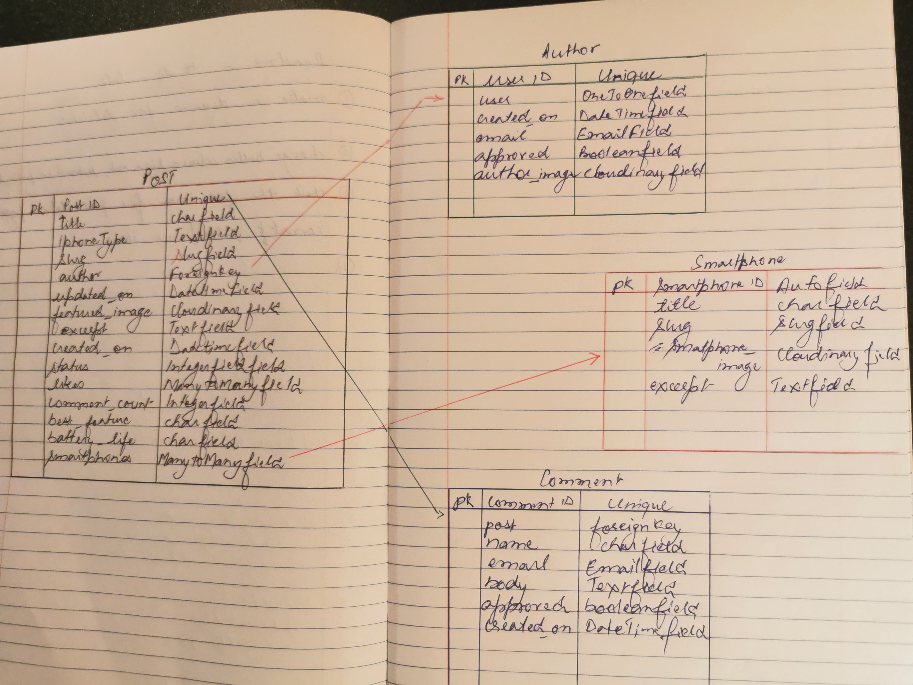
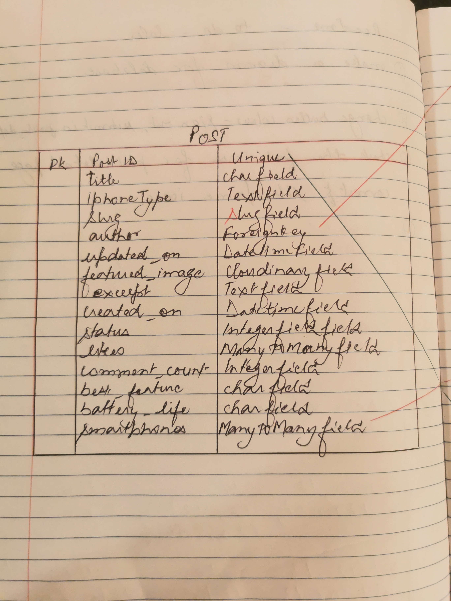

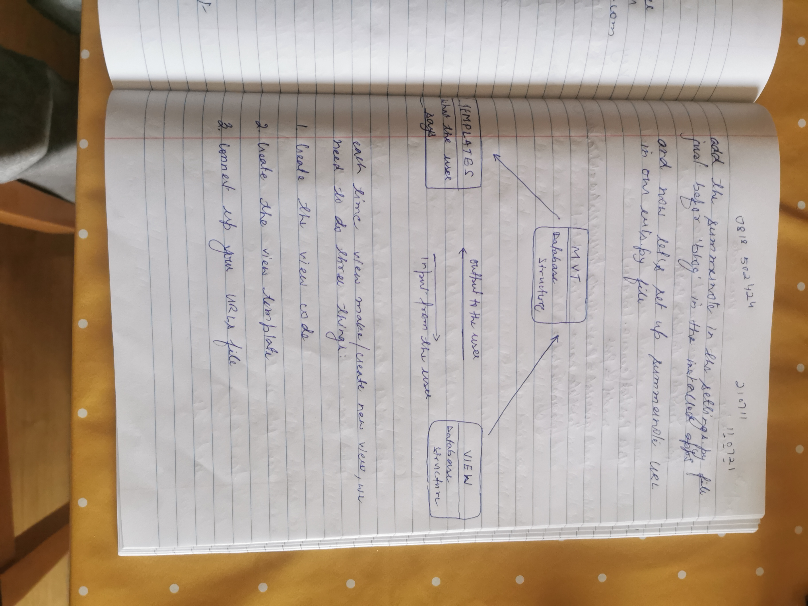
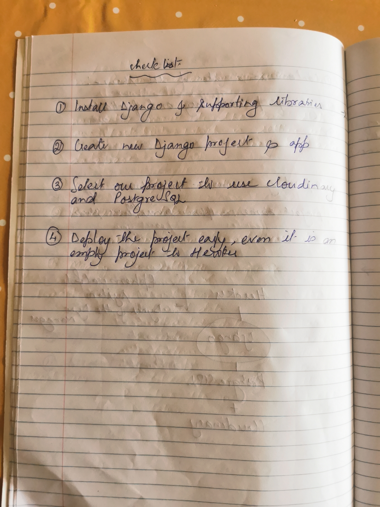

----
[Back to top ⇧](#content)

# Features

## Home Page

At the very first glimpse, user can see a Navigation menu with carousel-images on the homepage. Homepage provides the user with some quick information about the site and make use of all of its features. User do not need to be registered to view a blog post. The responsive navigation bar is featured on all pages. 

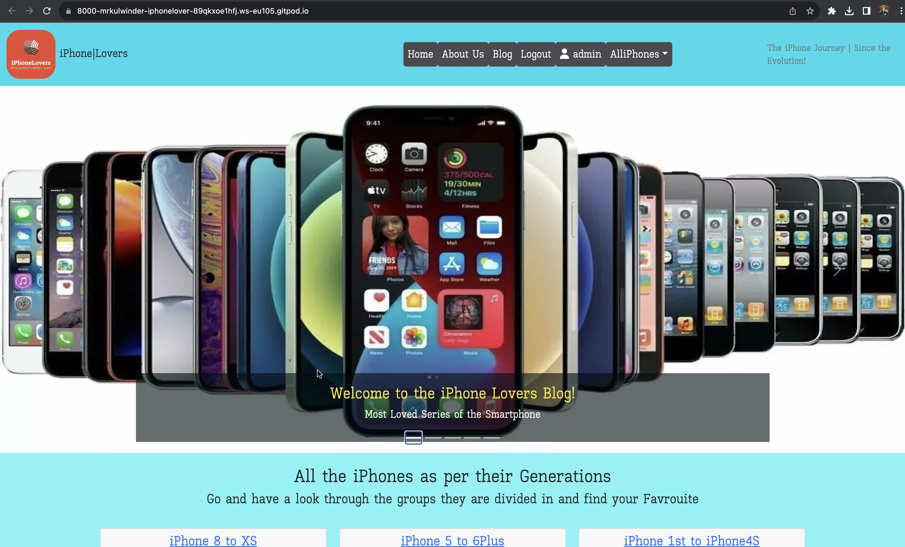

----

## Navbar

- The navigation bar is present at the top of every page and navigates all links to the respective pages.
- The options to Sign Up or Log in will change to the option to log out once a user has logged in.
- The navbar is fully responsive, collapsing into a hamburger menu when the screen size becomes smaller.

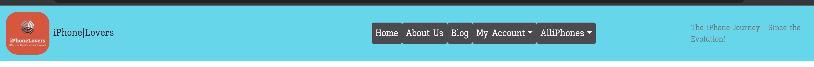


## Navbar after loged in user

* If the user is logged in (username admin is provided as an example here), navbar will be shown with user name and logout options. On a desktop, the navigation menu will appear as shown below:

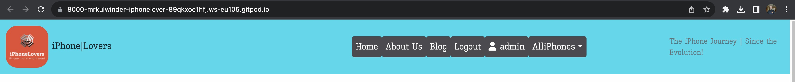 

* User can access all his posts by clicking on 'View Old Post' button. User can see the list of posts in this page which he has posted till now. Here he/she can edit or delete any of his post.

* If the user wants to edit his/her post, the following update form will be displayed with pre-filled content.


* User can see a gentle warning message to make sure if he wants to delete his post.


* If the user hasn't posted anything before, the user will be shown that there are no posts and they can create.

----

## Footer

- On the website footer, users can see basic information such as my social media, copyright, and a quote about Incredible India.

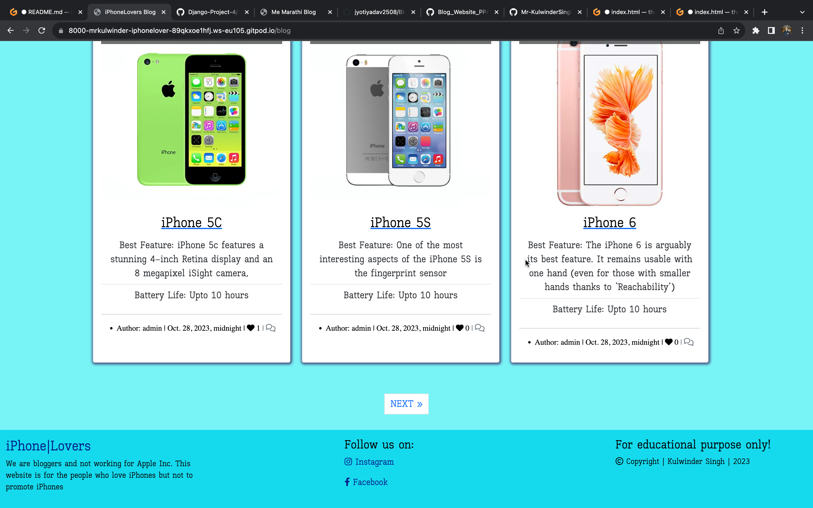

----

## About Page

- The About Us Page gives, users information about why we exist, our motive, and similar interest of people can follow us / join us with a brief discription of smartphone/iphones.

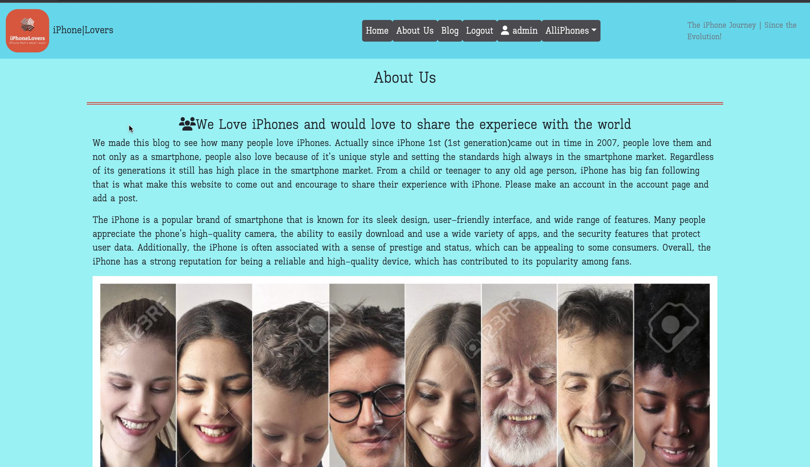

----

## Post-Detail Page

- When a user clicks on the image or title of the blog post, they are brought to the post details page for the selected blog post. Here the user is shown the complete details of the blog post with image, author name, created time, title, best feature, battery life of the device, number of likes and comments along with full content.
- Underneath the post description the page displays all the approved comments on that blog post posted by signed-in users. 
- At the bottom of this page, the Comment box is visible to the users.

- If user is signed-in, a comment box will appear on the bottom right hand side. 

- When User submit a comment or like/unlike a post, following messages/ alert displays respectively.

- When user clicks on update button, a successful update alert message is displayed.

----
## iPhone Page

User can select a specific group of iPhones as per their model name and generation from the title or blog posts either from group section on home page or from the navbar dropdown which navigates to that specific groups of blog posts.


## Security
In order to properly interact with the website, the user needs to have an account and sign in. This ensures security of their comments and gives them rights to create, modify and delete them.

### Sign Up

- User is asked to enter username and password to sign up. User will be guided by validation messages if the username exists or password is too small which was created by modifying Django inbuilt templates.


- When users sign up to the website they will see a message at the top of the page saying "Successfully signed in as (username)".


### Sign In

- User can enter username and password to sign in. User will be guided by validation messages if the username or password is not correct. This was created by modifying Django inbuilt templates.


- When users sign in to the website they will see a message at the top of the page saying "Successfully signed in as (username)".

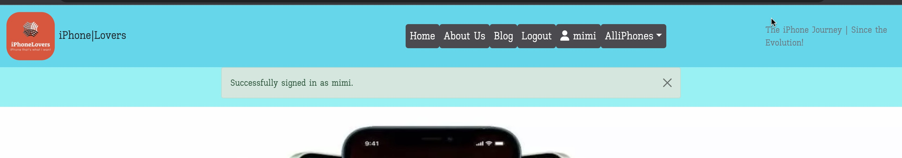
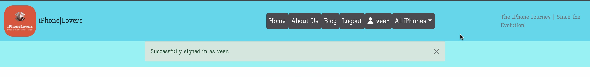


### Sign Out

- If the user is signed-in, then only they can see Logout nav-item in navbar. User will be taken to the Sign Out page. This was created by modifying Django inbuilt templates. When the user signs out, they are redirected to homepage.

- When users log out of the website they will see a message at the top of the page saying "You have signed out".

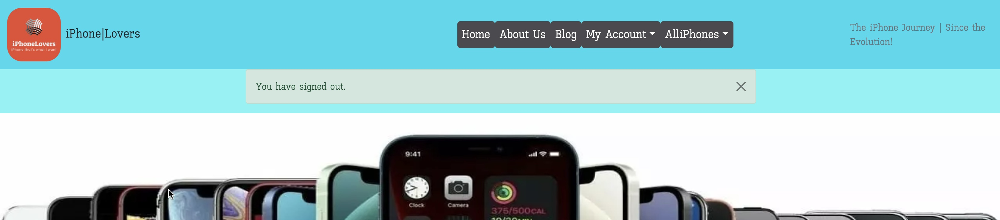

----

[Back to top ⇧](#content)

## Admin Panel/Superuser

- Admin accesses the project via logging into Django admin panel with a superuser id and password.
- A superuser "admin" was created for this project to manage the admin panel.
- On the Admin Panel, as an admin I have full access to CRUD functionality so I can view, create, edit and delete the following ones:
  - Posts
  - Comments
  - Author
  - Destination
- As admin I can also approve comments, approve posts and change the status and give other permissions to the users.

### Admin 'Post' Model Management

- On selecting Blog "Post", a list of blog posts are displayed with their title, slug, status, created_on and author name. Admin can select the post and edit or delete its data.
- When a blog post is submitted by a user, its status is set to Draft by default.
- When the status is set to Publish on Admin Approval, the post starts appearing in the website.

### Admin 'Comment' Model Management

- Upon selecting the Blog "Comment" model, a list of comments on a post is displayed with the username, comment body, post title, status and created_on. Admin can select the comment and edit or delete its data.
- When a comment is submitted by a user, it requires approval from an admin in order to publish it on the comments section.

### Admin 'Destination' Model Management

- On selecting the Blog iPhone(backend name - "smartphone") model, a list of iPhones(smartphones) for the blog post is displayed with title, slug and excerpt fields. Only Admin can add, edit or delete any iPhone(backend-name 'smartphone') data.

----

## Technologies Used

### Languages Used

* [HTML 5](https://en.wikipedia.org/wiki/HTML/)- Used to structure all the templates on the site
* [CSS 3](https://en.wikipedia.org/wiki/CSS)- to provide extra styling to the site
* [JavaScript](https://www.javascript.com/)- Minimum javascript was used to fade out alerts after a few seconds.
* [Python](https://www.python.org/)- To provide the functionality to the site. Packages used in the project can be found in requirements.txt

### Django Packages

* [Gunicorn](https://gunicorn.org/)- As the server for Heroku.
* [Cloudinary](https://cloudinary.com/)- Was used to host the static files and media for the site.
* [Dj_database_url](https://pypi.org/project/dj-database-url/)- To parse the database URL from the environment variables in Heroku.
* [Psycopg2](https://pypi.org/project/psycopg2/)- As an adaptor for Python and PostgreSQL databases.
* [Summernote](https://summernote.org/)- As a text editor.
* [Allauth](https://django-allauth.readthedocs.io/en/latest/installation.html)- For authentication, registration, account management.
* [Crispy Forms](https://django-crispy-forms.readthedocs.io/en/latest/)- To style the forms.

### Frameworks - Libraries - Programs Used

* [Django](https://www.djangoproject.com/) was used as the framework for the back-end logic of the project. Django enables rapid and secure development.
* [Bootstrap](https://getbootstrap.com/)- Used to style the website, add responsiveness and interactivity.
* [Git](https://git-scm.com/)- Used for version control by utilizing the Gitpod terminal to commit to Git and push to GitHub.
* [GitHub](https://github.com/)- Used to store the project's code after being pushed from Git.
* [Heroku](https://id.heroku.com)- Used to deploy the live project.
* [PostgreSQL](https://www.postgresql.org/)- Database used through heroku.
* [Balsamiq](https://balsamiq.com/)- To build the wireframes for the project.
* [Google Chrome Developer Tools](https://developers.google.com/web/tools/chrome-devtools) was used to inspect page elements, debug, troubleshoot and test features and adjust property values. Using the Lighthouse extension installed in Chrome Browser, the performance report was generated.
* [Google Fonts:](https://fonts.google.com/) used for the Roboto font
* [Font Awesome:](https://fontawesome.com/) was used to add icons for aesthetic and UX purposes.

-----

[Back to top ⇧](#content)

## Testing

### Performance

#### Google's Lighthouse Performance

##### Desktop Results:
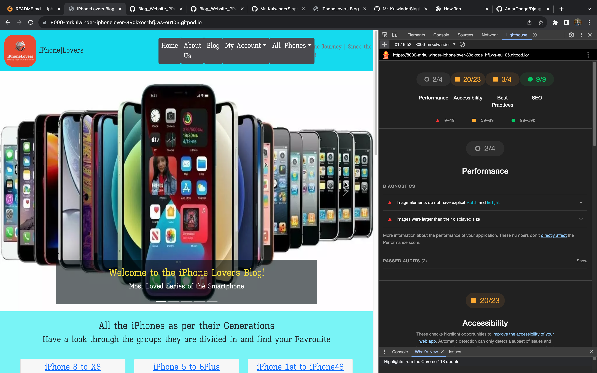.

##### Mobile Results:
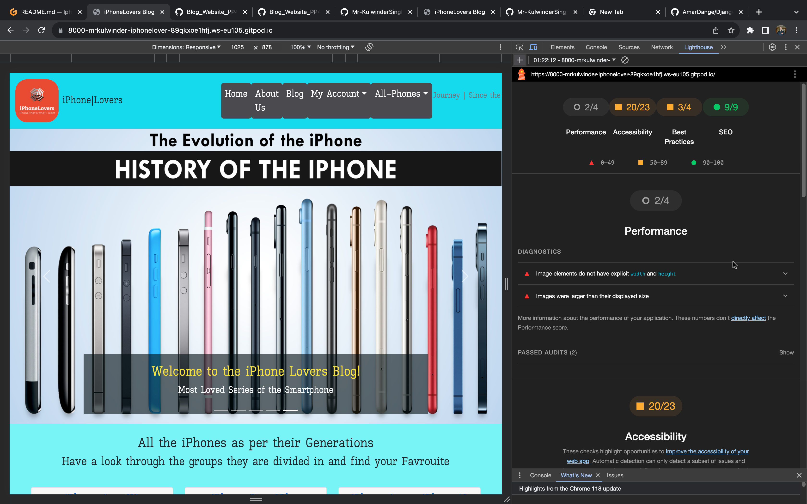.

### Validation
I used the following validation tools to validate HTML, CSS, PYTHON codes. 

- HTML using [W3C HTML validator](https://validator.w3.org/) was used to validate the HTML of the website.
All the Django templates html files hava been manually copying the source of the rendered pages and then validating using the W3C Validator. I found some erros and warning messages but These do not seem to affect the functionality of the website.

  - result for [base.html](assets/testing/base.png)
  - result for [index.html](assets/testing/home-page.png)
  - Result for [about page](assets/testing/about.png)
  - Result for [blog page](assets/testing/blog-page.png)
  - Result for [post-detail page](assets/testing/post-detail.png)
  - Result for [smartphones](assets/testing/smartphones.png)
  - Result for [smartphones post](assets/testing/smartphones-post.png)
  - Result for [user post list](assets/testing/user-post-list.png)
  - Result for [user page](assets/testing/user-page.png)
  - Result for [add-post page](assets/testing/add-post.png)
  - Result for [update post](assets/testing/update-post.png)
  - Result for [delete post](assets/testing/delete-post.png)


- CSS using [Jigsaw CSS validator](https://jigsaw.w3.org/css-validator/) was used for validating the CSS stylesheet. CSS file was tested by manually copying the CSS codes into the manual input option.

  - The result can be seen [here](assets/testing/style.png).

- Python via [PEP8 CI Python Linter](https://pep8ci.herokuapp.com/)

  - Blog
    * [admin.py](assets/testing/admin.png)
    * [models.py](assets/testing/models.png)
    * [forms.py](assets/testing/forms.png)
    * [urls.py](assets/testing/urls.png)
    * [views.py](assets/testing/views.png)

### Manual Testing
Testing has taken place continuously throughout the development of the project. Each view was tested regularly. When the outcome was not as expected, debugging took place at that point. An exhaustive list of features were checked on different devices and browsers.

## Bugs

| **Bug** | **Fix** |
| ----------- | ----------- |
| In navbar, the menu item AlliPhones dropdown was not populating.| Create smartphone_list view that return context (smartphone_list) then add `'iphoneblog.views.smartphones_list'` in templates section in settings.py file |
| Post image was not rendering on post_detail page(Issue only for mobile screens). | Remove class 'd-none' from post_detail page |
| Alert messages was not disappeare after setTimeOut(2000)<br><details><summary>Alert Code</summary>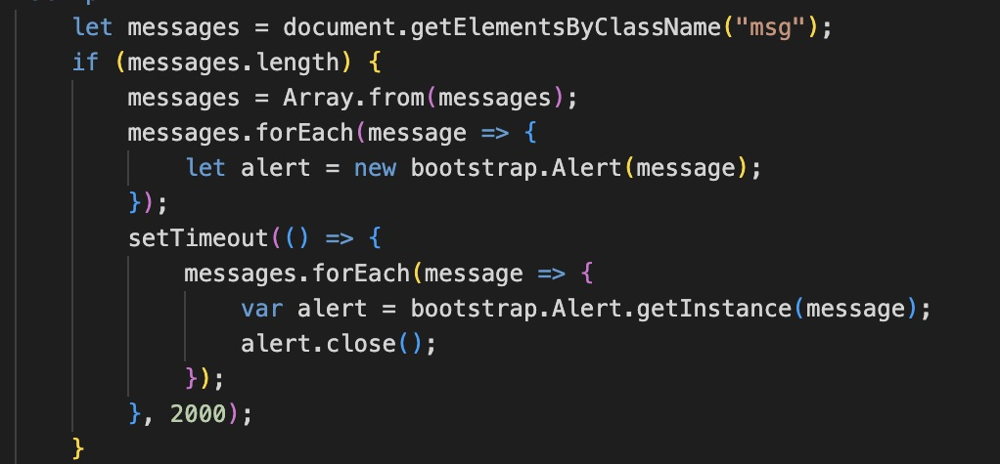</details> | Copy code from bootstrap alert and customize with forEach <br><details><summary>New Alert Code</summary> tried as shown in the image but no success to fix!


| **Unfix Bug** |
| ----------- | 
| When a logged in user adds a new post, the post slug should automatically be created from the post title. But the slug field is empty in the database. Slug is a required field when admin publishes a draft post, so here admin manually filled the slug field during publishing. Below is the screenshot from the post model in admin panel and view for Add Post. 
| In the Blog page when you click on next it shows the posts are overlapping.

----

## Future Implementation

* Automated testing for views functions 
* Adding and displaying replies below corresponding comments on our blog
* Adding the comment count views function
* Adding another blog for Samasung smartphones
* Adding the search bar to find a particular mobile phone (important one)

[Back to top ⇧](#content)


## Deployment

### 1. Creating the Django Project
* Go to the Code Institute Gitpod Full Template [Template](https://github.com/Code-Institute-Org/gitpod-full-template).
* Click on `Use This Template` button, then create new repository.
* Name our repository and click on `Create repository from template` button.
* Once the template is available in your repository click on `Gitpod` button.
* When the image for the template and the Gitpod are ready, open a new terminal to start a new Django App.
* Install Django and gunicorn: `pip3 install 'django<4' gunicorn`.
* Install supporting database libraries dj_database_url and psycopg2 library: `pip3 install dj_database_url==0.5.0 psycopg2`.
* Install Cloudinary libraries to manage static files: `pip install dj-3-cloudinary-storage`.
* Create file for requirements: `pip freeze --local > requirements.txt`.
* Create project:`django-admin startproject project_name .`.
* Create app: `python manage.py startapp app_name`.
* Add app to list of `installed apps` in settings.py file: `'app_name'`.
* Migrate changes: `python manage.py migrate`.
* Test server works locally: `python manage.py runserver`.
* If the app has been installed correctly the window will display- The install worked successfully! Congratulations!

### 2. Create your Heroku app
* Navigate to [Heroku](https://id.heroku.com).
* Create a Heroku account by entering your email address and a password (or login if you have one already).
* Activate the account through the authentication email sent to your email account.
* Click the **new button** on the top right corner of the screen and select create a new app from the dropdown menu.
* Enter a unique name for the application.
* Select the appropriate region for the application.
* Click create app.
* Click Reveal Config Vars and add a new record with `DATABASE_URL`.
* Click Reveal Config Vars and add a new record with `PORT`.
* Click Reveal Config Vars and add a new record with the `DISABLE_COLLECTSTATIC = 1`(note: this must be either removed or set to 0 for final deployment).
* Next, scroll down to the Buildpack section, click `Add Buildpack` select python and click Save Changes.

### 3. Set up Environment Variables
* In you IDE create a new env.py file in the top level directory.
* Add env.py to the .gitignore file.
* In env.py import the os library.
* In env.py add `os.environ["DATABASE_URL"]` = "Paste the link copied from Heroku DATABASE_URL".
* In env.py add `os.environ["SECRET_KEY"] = "Make up your own random secret key"`.
* In Heroku Settings tab Config Vars enter the same `SECRET_KEY` created in env.py by entering 'SECRET_KEY' in the box for 'KEY' and your randomly created secret key in the 'value' box.

### 4. Setting up settings.py
* In your Django 'settings.py' file type:

 ```
 from pathlib import Path
 import os
 import dj_database_url

 if os.path.isfile("env.py"):
  import env
 ```
* Remove the default insecure secret key in settings.py and replace with the link to the secret key variable in Heroku by typing: `SECRET_KEY = os.environ.get(SECRET_KEY)`
* Comment out the `DATABASES` section in settings.py and replace with:
```
DATABASES = {
  'default': 
  dj_database_url.parse(os.environ.get("DATABASE_URL"))
  }`
```
* Create a Cloudinary account and from the 'Dashboard' in Cloudinary copy your url into the env.py file by typing: `os.environ["CLOUDINARY_URL"] = "cloudinary://<insert-your-url>"`
* In Heroku, click Reveal Config Vars and add a new record with the `CLOUDINARY_URL`
* Add Cloudinary libraries to the installed apps section of settings.py file:
 ```
 'cloudinary_storage'
 'django.contrib.staticfiles''
 'cloudinary'
 ```
* Connect Cloudinary to the Django app in `settings.py`:
```
STATIC_URL = '/static'
STATICFILES_STORAGE = 'cloudinary_storage.storage.StaticHashedCloudinaryStorage'
STATICFILES_DIRS = [os.path.join(BASE_DIR, 'STATIC')]
STATIC_ROOT = os.path.join(BASE_DIR, 'staticfiles')
MEDIA_URL = '/media/'
DEFAULT_FILE_STORAGE =
'cloudinary_storage.storage.MediaCloudinaryStorage'
* Link file to the templates directory in Heroku 
* Place under the BASE_DIR: TEMPLATES_DIR = os.path.join(BASE_DIR,
'templates')
```
* Change the templates directory to TEMPLATES_DIR. Place within the TEMPLATES array: `'DIRS': [TEMPLATES_DIR]`
* Add Heroku Hostname to ALLOWED_HOSTS: 
```ALLOWED_HOSTS = ['<Heroku_app_name>.herokuapp.com', 'localhost']```
* Create Procfile at the top level of the file structure and insert the following:
    ``` web: gunicorn PROJECT_NAME.wsgi ```

* Commit and push the code to the GitHub Repository.

### 5. Heroku Deployment: 
* Click Deploy tab in Heroku.
* Select Github as the deployment method.
* Confirm you want to connect to GitHub.
* Search for the repository name and click the connect button to link the heroku app with the Github repository. The box will confirm that heroku is connected to the repository.
* Scroll to the bottom of the deploy page and select the preferred deployment type.
* Click either Enable Automatic Deploys for automatic deployment when you push updates to Github or To manually deploy click the button 'Deploy Branch'. The default 'main' option in the dropdown menu should be selected in both cases. When the app is deployed a message 'Your app was successfully deployed' will be shown. Click 'view' to see the deployed app in the browser.

### 6. Final Deployment
In the IDE:
* When development is complete change the debug setting to: `DEBUG = False` in `settings.py` 
* In Heroku settings config vars change the `DISABLE_COLLECTSTATIC` value to 0
* Because DEBUG must be switched to True for development and False for production it is recommended that only manual deployment is used in Heroku. 
* To manually deploy click the button 'Deploy Branch'. The default 'main' option in the dropdown menu should be selected in both cases. When the app is deployed a message 'Your app was successfully deployed' will be shown. Click 'view' to see the deployed app in the browser.

----

[Back to top](#content)

# Credits

## Code
- The basic set up of the website was done by strictly following the steps as described in Code Institue Full Stack Frameworks module - Django walkthrough project `"I Think Therefore I Blog"`.


## Learning Resources
- Code Institutes Full Stack Framework Module, mainly the 'blog' walkthrough project.
- Youtube videos by [Codemy](https://www.youtube.com/watch?v=6-XXvUENY_8&list=PLCC34OHNcOtr025c1kHSPrnP18YPB-NFi&index=5)
- [W3CSchool](https://www.w3schools.com/django/)
- [Django Documentation](https://docs.djangoproject.com/en/3.2/ref/models/fields/#field-types)(For different quaries while doing project. For example query about models, fields, form widgets, auth and many more)
- Other open source to understand and solve following types of error : UnboundedLocalError, MultivalueDictKeyError,  ProgrammingError, InvalidCursorName etc.
- Youtube videos [The Dumbfounds](https://www.youtube.com/playlist?list=PLbpAWbHbi5rMF2j5n6imm0enrSD9eQUaM) for automated testing.


## Acknowledgement

Special thanks to my mentor Juliia, My fellow student Amar & Jyoti, Tutor support and Slack community for their assistance throughout this project.

[Back to top](<#content>)

